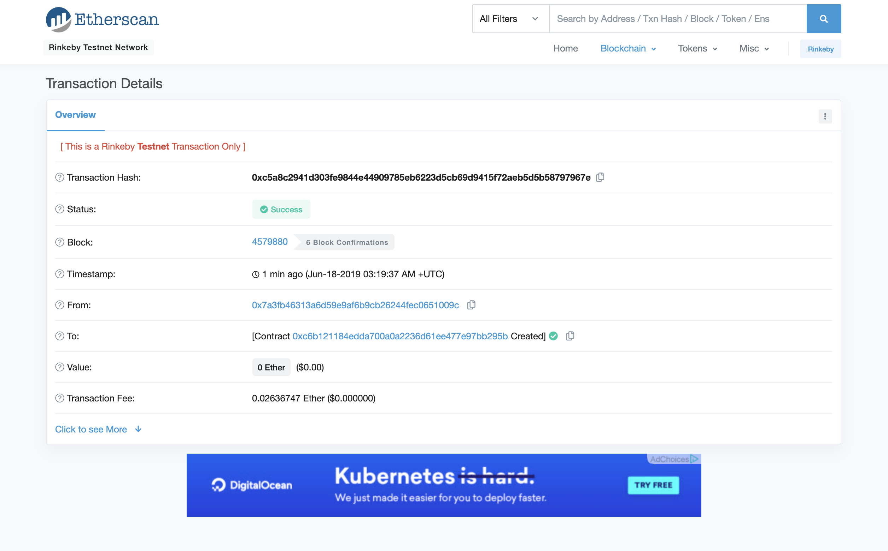

# Build CryptoStar DApp on Ethereum

Project to develop a DApp and deploy to the Rinkeby network.

Deployed Contract Address: 0xc6b121184eDDA700A0a2236d61EE477e97Bb295B

## Requirements

- Truffle (https://www.trufflesuite.com/)
- OpenZeppelin (https://www.npmjs.com/package/openzeppelin-solidity/v/2.0.1)
- Node.js (https://nodejs.org/en/)
- [Infura Account](https://infura.io/)
- MetaMask (https://metamask.io/)

## Running the Application

1. Unzip starnotaryv2.zip and cd into the folder

   ```
   cd starNotaryv2
   ```

2. Install all necessary packages and initialize npm

   ```
   npm install -g truffle
   truffle init
   npm install --save truffle-hdwallet-provider
   npm install openzeppelin-solidity
   ```

3. Update configuration file (truffle.js) with infuraKey and mnemonic

   ```
   infuraKey = "<Infura PROJECT ID>";
   mnemonic = "<METAMASK SEED>";

   ```

4. From root folder, deploy StarNotary contract to network
   ```
   truffle compile
   truffle migrate --reset --network rinkeby
   ```
5. Run Application
   ```
   cd app
   npm run dev
   ```
6. Go to http://localhost:8080/ to view application

# Testing

Start `truffle develop` then run the following:

```
migrate --reset
test
```

All 9 tests should pass

## Etherscan screen shot


## Transaction screen shot


